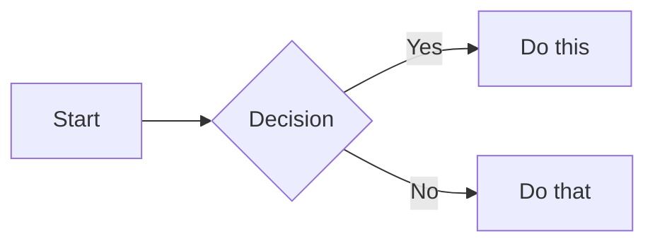

<!-- Needs `mermaid: true` in front matter. Any Mermaid diagram type works inside a ```mermaid fence. -->


```mermaid
flowchart LR
  A[Start] --> B{Decision}
  B -->|Yes| C[Do this]
  B -->|No| D[Do that]
```
